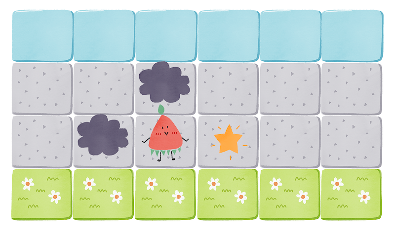

# The Frogger Game

## How to Play

Use arrow keys to move the player to the other side.
Avoid the dark clouds and collect as many stars as possible.
[Click me to play the game!](https://tinylittlemaggie.github.io/The-Frogger-Game)

## The Concept
This is a project I've completed with Udacity's Front-End Web Development Nanodegree. Basic graphic assets and a game engine were provided by Udacity, and students are required to complete the rest of the game using JavaScript.

I've added a personal touch to the game by updating the graphic assets myself.

## Skills

1. This project has been an opportunity to practice what I've learned in the **Object-oriented Programming** section of the online programme. Class functions (like `Player` and `Enemy`) and class prototype functions such as `Enemy.prototype.checkCollisions` are used to implement the entities that you see on the screen.

Here's the project [rubric](https://review.udacity.com/#!/rubrics/15/view) in detail.

2. Graphic assets are made in Tayasui Sketches
